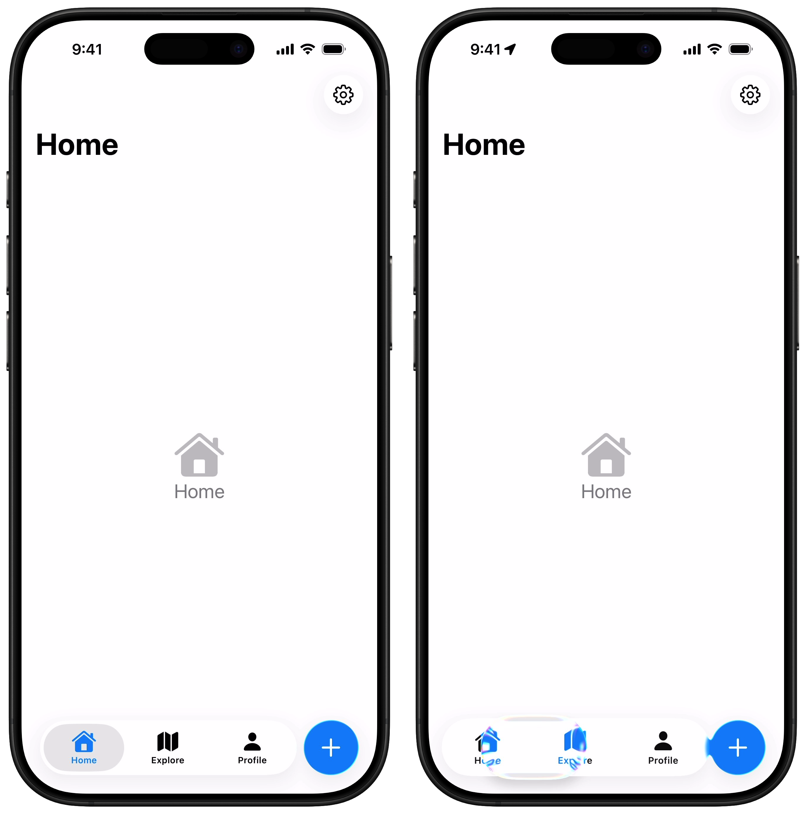
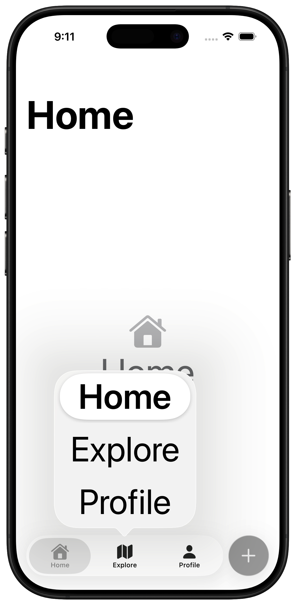

# FabBar

A faithful recreation of the iOS 26 Liquid Glass tab bar with a tinted floating action button.

> **Warning:** This library relies on internal UIKit view hierarchy manipulation that may break in future iOS updates. Use at your own risk.



## Why FabBar?

Many apps have a primary action that users perform frequently: composing a social media post, logging a meal, creating a task. Placing this action at the bottom of the screen keeps it in the thumb zone and always visible, reducing friction for the most common user flow.

With iOS 26's tab bar, developers can declare a tab with `role: .search` and abuse it as a primary action, but this approach has several issues:

- You're lying to the system, it's not actually a search tab
- VoiceOver reads it as a tab, not a button
- Requires listening for tab changes and undoing them in SwiftUI, which is prone to race conditions
- No ability to tint, so it looks like a search tab rather than a primary action

Developers have another option: placing a custom floating action button above the tab bar. Typically, this is placed on the right side of the screen. However, with iOS 26's centered tab bar, this creates an awkward layout. With fewer than four tabs, there's negative space on either side of the bar, and placing a FAB on the trailing edge creates unbalanced empty space below it. And there's no way to customize the native tab bar's placement or sizing to work around this.

FabBar provides one solution: recreate the tab bar entirely for full control.

## How It Works

FabBar provides a SwiftUI API but uses UIKit internally.

The key challenge in faithfully recreating the tab bar is the bubbly interactive glass effect on touch down. This effect is only available to tab bars and one other component: segmented controls. FabBar uses a `UISegmentedControl` as its foundation, hiding the default labels and overlaying custom tab item views.

Why UIKit? FabBar manipulates `UISegmentedControl`'s internal view hierarchy to hide the native labels and overlay custom views. This isn't possible with SwiftUI's Picker. Additionally, mixing custom UIKit controls with SwiftUI's `.glassEffect()` causes framerate issues during touch interactions.

This approach is inherently brittle and may break across OS updates. See [Known Limitations](#known-limitations) for other tradeoffs.

Credit to [Kavsoft](https://youtu.be/wfHIe8GpKAU?si=ASViL-OuhqQwEWzr) for the original idea of using a segmented control to imitate a tab bar.

## Installation

Add FabBar as a Swift Package dependency:

```swift
dependencies: [
    .package(url: "https://github.com/ryanashcraft/FabBar.git", from: "1.0.0")
]
```

## Usage

```swift
import FabBar

enum AppTab: Hashable {
    case home, explore, profile
}

struct ContentView: View {
    @State private var selectedTab: AppTab = .home
    @Environment(\.horizontalSizeClass) private var horizontalSizeClass

    private var tabBarVisibility: Visibility {
        horizontalSizeClass == .compact ? .hidden : .visible
    }

    var body: some View {
        TabView(selection: $selectedTab) {
            Tab("Home", systemImage: "house.fill", value: .home) {
                HomeView()
                    .fabBarSafeAreaPadding()
                    .toolbarVisibility(tabBarVisibility, for: .tabBar)
            }
            Tab("Explore", systemImage: "compass", value: .explore) {
                ExploreView()
                    .fabBarSafeAreaPadding()
                    .toolbarVisibility(tabBarVisibility, for: .tabBar)
            }
            Tab("Profile", systemImage: "person.fill", value: .profile) {
                ProfileView()
                    .fabBarSafeAreaPadding()
                    .toolbarVisibility(tabBarVisibility, for: .tabBar)
            }
        }
        .fabBar(
            selection: $selectedTab,
            tabs: [
                FabBarTab(value: .home, title: "Home", systemImage: "house.fill"),
                FabBarTab(value: .explore, title: "Explore", systemImage: "compass"),
                FabBarTab(value: .profile, title: "Profile", systemImage: "person.fill"),
            ],
            action: FabBarAction(
                systemImage: "plus",
                accessibilityLabel: "Add Item"
            ) {
                // Handle FAB tap
            }
        )
    }
}
```

The `.fabBar()` modifier handles positioning, safe area management, and automatically hides on iPad (showing the native tab bar instead). Use `.fabBarSafeAreaPadding()` on scrollable content within each tab to ensure content isn't hidden behind the bar.

For more control over positioning, you can use the `FabBar` view directly.

### Custom Images

Use custom images from your asset catalog instead of SF Symbols:

```swift
FabBarTab(
    value: .library,
    title: "Library",
    image: "custom.library.icon",
    imageBundle: .main
)
```

### Tab Reselection

Handle when users tap an already-selected tab (useful for scroll-to-top):

```swift
FabBarTab(
    value: .home,
    title: "Home",
    systemImage: "house.fill",
    onReselect: {
        // User tapped this tab while it was already selected
        scrollToTop()
    }
)
```

### Conditional Visibility

Hide the FabBar based on app state (e.g., during selection mode):

```swift
.fabBar(
    selection: $selectedTab,
    tabs: tabs,
    action: action,
    isVisible: !isSelecting
)
```

### Manual Positioning

For more control, use the `FabBar` view directly instead of the modifier. Apply 21pt padding on all sides:

```swift
.safeAreaBar(edge: .bottom) {
    if horizontalSizeClass == .compact {
        FabBar(selection: $selectedTab, tabs: tabs, action: action)
            .padding(.horizontal, 21)
            .padding(.bottom, 21)
    }
}
.ignoresSafeArea(.container, edges: .bottom)
```

## Example

See the [Example project](Example/FabBarExample) for a complete implementation.

## Known Limitations

**Large Content Viewer:** Native tab bars show the [Large Content Viewer](https://developer.apple.com/videos/play/wwdc2019/261/) on long press when using accessibility text sizes. FabBar uses a segmented control internally, which shows a popover instead. Attempts to add Large Content Viewer support were unsuccessful due to inability to disable the default popover.



**VoiceOver focus after tab selection:** After activating a new tab with VoiceOver, focus may jump to the first tab instead of remaining on the selected tab.

**No native tab reselection behavior:** Native tab bars automatically scroll to top when reselecting a tab. FabBar doesn't get this behavior; use the `onReselect` callback to implement it yourself.

**Hardcoded dimensions:** Bar height, spacing, and font sizes are hardcoded to match iOS 26's tab bar. If Apple changes these values in future iOS versions, FabBar won't automatically update to match.

## License

MIT License. See [LICENSE](LICENSE) for details.
